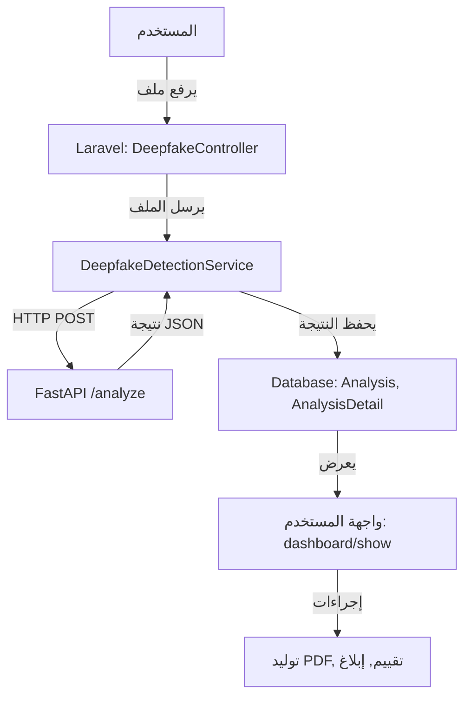

# دليل نظام كشف التزييف العميق (Deepfake Detection System)

---

## الفهرس
1. مقدمة
2. الهيكل العام للمشروع
3. الأدوات والتقنيات والمكتبات المستخدمة
4. صلاحيات المستخدمين والخصوصية
5. شرح كل جزء وظيفياً
6. تدفق البيانات من رفع الملف حتى التقرير
7. شرح الذكاء الاصطناعي (تحليل الصور/الفيديو/الصوت)
8. واجهات المستخدم (Blade) وتفصيل كل صفحة
9. آلية التقييم والإبلاغ
10. آلية توليد وتحميل تقارير PDF
11. العلاقات بين الملفات والمكونات
12. أمثلة عملية (سيناريوهات)
13. ملحق: مخططات تدفق البيانات
14. ملاحظات إضافية
15. الحالات الخاصة والأخطاء (Special Cases & Errors)
16. واجهة API (ملحق للمطورين)

---

## تحديثات وتوضيحات هامة

### 1. قواعد القرار لنموذج الصوت (Threshold Logic)

- **قيمة العتبة (Confidence Threshold):**
  - العتبة المستخدمة لتصنيف مقطع صوتي على أنه "مزيف بثقة عالية" هي **0.75** (أي إذا كانت احتمالية التزييف > 0.75 يعتبر المقطع مزيف بثقة عالية).
- **عدد المقاطع:**
  - إذا كان هناك **3 مقاطع أو أكثر** مصنفة كـ "مزيفة بثقة عالية"، يُعتبر الملف الصوتي بالكامل مزيفاً.
- **هل هي ثابتة أم قابلة للتخصيص؟**
  - هذه القيم **ثابتة في الكود الحالي** (hardcoded)، ويمكن تعديلها برمجياً إذا لزم الأمر.
- **هل تم اختبارها تجريبياً؟**
  - تم وضع هذه القاعدة بناءً على ملاحظات أولية وتجارب عملية أثناء تطوير النظام، لكنها ليست نتيجة دراسة إحصائية موسعة. يوصى بتحديثها مستقبلاً بناءً على بيانات حقيقية وتجارب أوسع.

### 2. سياسة الخصوصية وحذف التحليلات

- **مدة حفظ التحليلات:**
  - التحليلات تحفظ في قاعدة البيانات **حتى يقوم المستخدم بحذفها يدوياً**.
  - لا يتم حذف التحليل تلقائياً بعد توليد التقرير أو بعد فترة زمنية.
- **حذف التحليل:**
  - يمكن للمستخدم حذف أي تحليل خاص به من لوحة التحكم.
  - عند حذف التحليل، يتم حذف جميع التفاصيل المرتبطة به (AnalysisDetail) من قاعدة البيانات.
- **حذف الملفات المرتبطة:**
  - عند حذف التحليل، يتم أيضاً حذف الملفات المرتبطة (صور الفريمات، الوجوه، صور MFCC) من التخزين (storage/app/public/analysis_frames) لضمان حماية الخصوصية وعدم بقاء بيانات حساسة.
- **سياسة الخصوصية:**
  - جميع التحليلات خاصة بالمستخدم ولا يمكن لأي طرف آخر الوصول إليها إلا في حال التقييم أو الإبلاغ.
  - يمكن للمستخدم حذف بياناته في أي وقت.
  - لا يتم الاحتفاظ بأي ملفات أو بيانات بعد الحذف.

### 3. نظام الانتظار/الصف (Queue/Job System) والتوسعة

- **آلية إرسال الملفات:**
  - حالياً، الملفات تُرسل **مباشرة** من Laravel إلى FastAPI عبر HTTP عند رفعها (synchronous call).
- **هل يوجد Queue؟**
  - لا يوجد نظام صف (Queue) أو Job System في النسخة الحالية. كل طلب تحليل يُنفذ فوراً.
- **ماذا يحصل عند رفع ملفات ضخمة أو طلبات كثيرة؟**
  - إذا تم رفع عدة ملفات أو ملفات ضخمة في نفس الوقت، قد يواجه النظام بطء أو تأخير في الاستجابة، خاصة إذا كانت موارد الخادم محدودة.
- **التوصيات المستقبلية (Scalability):**
  - يوصى مستقبلاً بإضافة نظام Queue (مثل Laravel Queue/Jobs) بحيث يتم وضع كل طلب تحليل في صف، ويعالجه عامل (Worker) منفصل، مما يسمح بتوزيع الأحمال وعدم استهلاك موارد الخادم دفعة واحدة.
  - يمكن أيضاً توزيع التحليلات على عدة خوادم FastAPI أو استخدام حاويات (Containers) لزيادة التوسعة.
  - يمكن مراقبة حالة التحليل (قيد الانتظار/قيد التنفيذ/مكتمل) وإبلاغ المستخدم عند انتهاء التحليل.

---

## تحديث في سياسة الخصوصية (ضمن قسم الخصوصية)
- التحليلات تحفظ حتى حذفها من قبل المستخدم.
- عند حذف التحليل، يتم حذف جميع الملفات المرتبطة نهائياً.
- لا يتم الاحتفاظ بأي بيانات بعد الحذف.

---

## تحديث في قسم الذكاء الاصطناعي (الصوت)
- قاعدة القرار: إذا كان هناك 3 مقاطع أو أكثر مزيفة بثقة > 0.75 يعتبر الملف مزيفاً.
- القيم ثابتة ويمكن تعديلها برمجياً.
- القاعدة وضعت بناءً على تجارب أولية ويُنصح بتحديثها مستقبلاً بناءً على بيانات حقيقية.

---

## تحديث في قسم البنية والتوسعة
- حالياً لا يوجد Queue، التحليل يتم مباشرة.
- يوصى مستقبلاً بإضافة Queue/Job System لتحمل الأحمال الكبيرة.

---

## 1. مقدمة

نظام كشف التزييف العميق هو منصة متكاملة تتيح للمستخدمين رفع ملفات (صور، فيديو، صوت) لتحليلها وكشف ما إذا كانت مزيفة (Deepfake) باستخدام تقنيات الذكاء الاصطناعي. النظام يوفر لوحة تحكم للمستخدم، تقارير مفصلة، تقييمات وبلاغات، وإدارة متقدمة للأدمن، مع مراعاة خصوصية المستخدمين بشكل صارم.

---

## 2. الهيكل العام للمشروع

```
Graduation Project/
├── laravel-app/         # تطبيق Laravel (الويب)
│   ├── app/
│   │   ├── Http/Controllers/   # الكنترولاتر (منطق الطلبات)
│   │   ├── Services/           # الخدمات (DeepfakeDetectionService)
│   │   ├── Models/             # نماذج البيانات (Analysis, ...)
│   │   └── ...
│   ├── resources/views/        # واجهات المستخدم (Blade)
│   ├── routes/                 # تعريف المسارات (web, api, auth)
│   └── ...
├── python-api/          # تطبيق FastAPI (الذكاء الاصطناعي)
│   ├── core/            # منطق التحليل (media_analyzer.py, ...)
│   ├── models/          # النماذج المدربة (EfficientNet, BiLSTM)
│   └── ...
└── storage/app/public/analysis_frames/  # مجلد مشترك لحفظ صور الفريمات والوجوه
```

---

## 3. الأدوات والتقنيات والمكتبات المستخدمة

### **Backend (Laravel):**
- Laravel 9+
- PHP 8+
- Eloquent ORM
- DomPDF (توليد PDF)
- Sanctum (توثيق API)
- Tailwind CSS (تصميم متجاوب)
- SweetAlert (نوافذ منبثقة)

### **Frontend:**
- Blade Templates (Laravel)
- Tailwind CSS
- JavaScript (بعض التفاعلات)
- SweetAlert

### **AI/ML (Python - FastAPI):**
- FastAPI (REST API)
- PyTorch (EfficientNet-B4)
- facenet-pytorch (MTCNN)
- OpenCV (معالجة الفيديو)
- Pillow (معالجة الصور)
- TensorFlow/Keras (BiLSTM للصوت)
- librosa (معالجة الصوت واستخراج الميزات)
- numpy, matplotlib (تحليل وعرض الميزات)
- streamlit (واجهة اختبار النماذج)

### **أخرى:**
- تخزين مشترك للصور والفريمات بين Laravel وFastAPI (storage/app/public/analysis_frames)
- حماية خصوصية المستخدمين (لا يرى الأدمن إلا التقارير المبلغ عنها أو المقيمة)

---

## 4. صلاحيات المستخدمين والخصوصية

### **المستخدم المسجل:**
- يمكنه رفع وتحليل الملفات (صور/فيديو/صوت).
- يمكنه مراجعة جميع تحليلاته وتقاريره السابقة من لوحة التحكم.
- يمكنه تحميل تقرير PDF لأي تحليل خاص به.
- يمكنه تقييم نتيجة التحليل (صحيحة/خاطئة).
- يمكنه الإبلاغ عن تقرير إذا كان خطيراً أو حساساً.

### **الزائر (غير المسجل):**
- يمكنه رفع ملف وتحليل واحد فقط في كل مرة.
- لا يمكنه حفظ أو مراجعة التحليلات السابقة أو تحميل PDF.

### **الأدمن:**
- لا يمكنه الوصول إلا للتقارير التي تم تقييمها أو الإبلاغ عنها من قبل المستخدمين.
- عند التقييم أو الإبلاغ، يصبح التقرير متاحاً للأدمن مع كامل التفاصيل (بما فيها الصور والفريمات والمقاطع الصوتية).
- يمكنه تحويل التقارير المبلغ عنها لجهة مختصة.

### **الخصوصية:**
- جميع التحليلات والتقارير خاصة بالمستخدم ولا يمكن لأي مسؤول أو أدمن الوصول إليها إلا في حال التقييم أو الإبلاغ.
- عند التقييم أو الإبلاغ، يوافق المستخدم على إتاحة كامل تفاصيل التقرير لمسؤولي الموقع.

---

## 5. شرح كل جزء وظيفياً

### أ. الكنترولاتر (Controllers)
- **DeepfakeController:** استقبال الملفات، تحديد النوع، إرسالها للذكاء الاصطناعي، حفظ النتائج.
- **DashboardController:** عرض لوحة المستخدم، تفاصيل التحليلات، استقبال التقييمات والبلاغات.
- **ReportController:** توليد وتحميل تقارير PDF، عرض صور التحليل.
- **AdminController:** إدارة المستخدمين، التحليلات، الصلاحيات.
- **ProfileController:** إدارة الحساب الشخصي.

### ب. الخدمات (Services)
- **DeepfakeDetectionService:** وسيط بين Laravel وFastAPI، يرسل الملفات عبر HTTP ويعيد النتائج.

### ج. النماذج (Models)
- **Analysis:** يمثل عملية تحليل واحدة (ملف واحد).
- **AnalysisDetail:** تفاصيل لكل جزء من الملف (فريم/وجه/مقطع).
- **User:** بيانات المستخدمين وصلاحياتهم.

### د. الواجهات (Views/Blade)
- **deepfake/index:** صفحة رفع وتحليل الملفات.
- **dashboard/show:** صفحة عرض تقرير التحليل المفصل.
- **components/analysis:** مكونات جزئية (معلومات عامة، تفاصيل تقنية، تحليل مفصل، إجراءات، نوافذ منبثقة).
- **admin/**: صفحات إدارة الأدمن.
- **reports/analysis:** قالب تقرير PDF.
- **auth/**: صفحات تسجيل الدخول والتوثيق.

### هـ. FastAPI (Python)
- **media_analyzer.py:** تحليل الصور والفيديو (اكتشاف الوجوه، تصنيفها، حفظ الصور).
- **audio_analyzer.py:** تحليل الصوت (تقطيع، استخراج ميزات MFCC، تصنيف، تحليل jitter/shimmer).
- **deepfake_app.py:** واجهة تفاعلية لاختبار النماذج.

---

## 6. تدفق البيانات من رفع الملف حتى التقرير

1. **رفع الملف:** المستخدم يرفع ملفاً عبر الواجهة.
2. **تحقق وتوجيه:** DeepfakeController يتحقق من النوع ويرسل الملف إلى DeepfakeDetectionService.
3. **إرسال إلى FastAPI:** الخدمة ترسل الملف إلى FastAPI عبر HTTP POST.
4. **تحليل الذكاء الاصطناعي:**
   - صورة: اكتشاف وجوه وتصنيفها.
   - فيديو: اختيار فريمات وتحليلها كصور.
   - صوت: تقطيع وتحليل كل مقطع.
5. **استلام النتيجة:** FastAPI يعيد JSON فيه النتيجة والتفاصيل.
6. **حفظ وعرض:** Laravel يحفظ النتيجة في قاعدة البيانات ويعرضها للمستخدم.
7. **توليد تقرير PDF:** عند الطلب، يولد تقرير PDF مفصل بالصور والنتائج.

---

## 7. شرح الذكاء الاصطناعي (تحليل الصور/الفيديو/الصوت)

### **معالجة الصور (Image Processing):**
1. استقبال الصورة من Laravel إلى FastAPI.
2. فتح الصورة وتحويلها إلى RGB.
3. اكتشاف جميع الوجوه باستخدام MTCNN (facenet-pytorch).
4. قص كل وجه وتغيير حجمه إلى 224x224.
5. تحويل الوجه إلى Tensor وتطبيعه (Normalization) حسب معايير EfficientNet.
6. تصنيف الوجه باستخدام EfficientNet-B4 (PyTorch) (REAL/FAKE) مع حساب الثقة.
7. حساب النتيجة النهائية حسب الأغلبية والثقة.
8. حفظ الصور الأصلية والمقصوصة في مجلد مشترك مع Laravel.
9. إرجاع JSON فيه تفاصيل كل وجه، المسارات، النتيجة النهائية، الثقة، عدد الوجوه.

### **معالجة الفيديو (Video Processing):**
1. استقبال الفيديو من Laravel إلى FastAPI.
2. قراءة الفيديو باستخدام OpenCV.
3. اختيار عدد محدد من الفريمات موزعة على طول الفيديو (مثلاً 10 فريمات).
4. لكل فريم: تحويله لصورة وتطبيق نفس خطوات معالجة الصورة.
5. حفظ صور الفريمات والوجوه.
6. حساب النتيجة النهائية حسب تصويت الفريمات والثقة.
7. إرجاع JSON فيه تفاصيل كل فريم، الوجوه، المسارات، النتيجة النهائية، الثقة.

### **معالجة الصوت (Audio Processing):**
1. استقبال الملف الصوتي من Laravel إلى FastAPI.
2. تحميل الصوت باستخدام librosa وتحويله إلى تردد ثابت (16kHz).
3. تقطيع الصوت إلى مقاطع قصيرة (2.5 ثانية) باستخدام VAD.
4. لكل مقطع: استخراج ميزات MFCC وDelta وDelta-Delta، وميزات متقدمة (jitter, shimmer, pitch variance).
5. تصنيف المقطع باستخدام BiLSTM (TensorFlow/Keras).
6. حساب النتيجة النهائية حسب عدد المقاطع المزيفة والثقة وقواعد إضافية (مثلاً إذا كان هناك أكثر من 3 مقاطع مزيفة بثقة عالية يعتبر مزيف).
7. إرجاع JSON فيه تفاصيل كل مقطع، الميزات، النتيجة النهائية، الثقة، صور MFCC (base64).

---

## 8. واجهات المستخدم (Blade) وتفصيل كل صفحة

### **deepfake/index.blade.php**
- صفحة رفع وتحليل الملفات.
- تعرض نموذج رفع، اختيار نوع الملف، زر تحليل.
- تعرض النتيجة مباشرة إذا لم يكن المستخدم مسجلاً.

### **dashboard/show.blade.php**
- صفحة عرض تقرير التحليل المفصل.
- مقسمة إلى:
  - معلومات عامة (اسم الملف، النتيجة، الثقة، المستخدم، التاريخ).
  - تفاصيل تقنية (النموذج، نوع التحليل، الميزات، إحصائيات).
  - التحليل المفصل (جدول الفريمات/الوجوه/المقاطع مع الصور والنتائج).
  - إجراءات (تحميل PDF، تقييم النتيجة، إبلاغ).
  - نوافذ منبثقة (عرض الصور، تقييم، إبلاغ).
- تستخدم مكونات جزئية:
  - `general-info`, `technical-details`, `detailed-analysis`, `actions`, `modals`.

### **admin/**
- صفحات إدارة الأدمن (المستخدمين، التحليلات، التفاصيل).
- الأدمن يرى فقط التقارير التي تم تقييمها أو الإبلاغ عنها.
- يمكنه تحويل التقارير المبلغ عنها لجهة مختصة.

### **reports/analysis.blade.php**
- قالب تقرير PDF مفصل.
- يعرض كل التفاصيل والصور والنتائج.

### **auth/**
- صفحات تسجيل الدخول، التسجيل، استعادة كلمة المرور.

---

## 9. آلية التقييم والإبلاغ

- **التقييم:** بعد ظهور نتيجة التحليل، يمكن للمستخدم تقييمها إذا كانت صحيحة أم لا. هذا يساعد في تحسين الذكاء الاصطناعي.
- **الإبلاغ:** إذا كان التقرير يحتوي على محتوى خطير أو حساس، يمكن للمستخدم الإبلاغ عنه. يصل البلاغ للأدمن، ويمكن تحويله لجهة مختصة.
- **تنويه الخصوصية:** عند التقييم أو الإبلاغ، يوافق المستخدم على إتاحة كامل تفاصيل التقرير (بما فيها الصور والفريمات) لمسؤولي الموقع.
- **الأدمن:** لا يرى إلا التقارير المبلغ عنها أو المقيمة، حفاظاً على خصوصية المستخدمين.

---

## 10. آلية توليد وتحميل تقارير PDF

- **ReportController@generate:** يجلب التحليل وتفاصيله من قاعدة البيانات.
- يحول الصور (الفريمات/الوجوه) إلى base64 لعرضها داخل التقرير.
- يستخدم DomPDF لتحويل واجهة Blade (`reports.analysis`) إلى PDF.
- يرسل الملف للمستخدم للتحميل باسم مميز (deepfake_report_{id}.pdf).
- لا يمكن للزائر تحميل PDF، فقط المستخدم المسجل.

---

## 11. العلاقات بين الملفات والمكونات

- **Controllers ↔ Services:** الكنترولاتر تستدعي الخدمات لإرسال الملفات وتحليلها.
- **Services ↔ FastAPI:** الخدمات ترسل الملفات عبر HTTP وتستقبل النتائج.
- **Models ↔ Database:** النماذج تمثل جداول قاعدة البيانات (تحليل، تفاصيل، مستخدم).
- **Views ↔ Controllers:** الواجهات تعرض البيانات القادمة من الكنترولاتر.
- **Components:** مكونات جزئية لإعادة استخدام واجهات عرض التفاصيل، الإجراءات، النوافذ المنبثقة.

---

## 12. أمثلة عملية (سيناريوهات)

### سيناريو 1: تحليل صورة
1. المستخدم يرفع صورة.
2. النظام يكتشف الوجوه ويصنفها.
3. تعرض النتيجة مع صور الوجوه.
4. يمكن للمستخدم تقييم النتيجة أو الإبلاغ.
5. يمكنه تحميل تقرير PDF إذا كان مسجلاً.

### سيناريو 2: تحليل فيديو
1. المستخدم يرفع فيديو.
2. النظام يختار عدة فريمات، يحلل كل فريم كصورة.
3. تعرض النتائج لكل فريم مع صور الوجوه.
4. يمكن تحميل تقرير PDF مفصل.

### سيناريو 3: تحليل صوت
1. المستخدم يرفع ملف صوتي.
2. النظام يقطع الصوت لمقاطع، يحلل كل مقطع.
3. تعرض النتائج لكل مقطع مع صورة MFCC.

### سيناريو 4: الأدمن يدير النظام
1. الأدمن يدخل لوحة الإدارة.
2. يرى فقط التقارير التي تم تقييمها أو الإبلاغ عنها.
3. يمكنه تحويل التقارير المبلغ عنها لجهة مختصة.
4. يطلع على تقييمات وبلاغات المستخدمين.

---

## 13. ملحق: مخططات تدفق البيانات

### مخطط تدفق البيانات (مبسط)



---

## 14. ملاحظات إضافية
- **الخصوصية أولاً:** لا يمكن لأي مسؤول أو أدمن الوصول لتحليل أو تقرير إلا إذا تم تقييمه أو الإبلاغ عنه من قبل المستخدم.
- **التقارير المبلغ عنها:** يمكن للأدمن تحويلها لجهة مختصة مع كامل التفاصيل.
- **النظام يدعم التقييمات والبلاغات لتحسين الذكاء الاصطناعي باستمرار.**
- **كل تحليل يحفظ تفاصيل دقيقة (فريمات، وجوه، مقاطع صوت، صور MFCC).**
- **واجهة المستخدم مصممة لتكون سهلة الاستخدام وسريعة الاستجابة (Responsive).**
- **النظام قابل للتطوير لإضافة أنواع ملفات أو نماذج ذكاء اصطناعي جديدة مستقبلاً.**
- **جميع البيانات الحساسة (صور، فريمات، أصوات) لا تُعرض إلا لصاحبها أو للأدمن في حال التقييم أو الإبلاغ فقط.**
- **النظام يلتزم بأفضل ممارسات الأمان وحماية البيانات.**

---

**هذا الدليل يغطي جميع الجوانب التقنية والوظيفية للمشروع، ويُعد مرجعاً شاملاً لأي مطور أو مسؤول أو مستخدم متقدم.**

---

## 8.1 منطق اتخاذ القرار (Decision Logic)

### **أولاً: الصور (Image Decision Logic)**

1. **اكتشاف الوجوه:**
   - استخدام MTCNN لاكتشاف جميع الوجوه.
   - إذا لم يتم اكتشاف أي وجه: النتيجة `UNKNOWN` (غير معروف)، الثقة = 0، مع سبب "No faces detected".
2. **تصنيف كل وجه:**
   - كل وجه يُقص ويُكبر إلى 224x224 ويمرر إلى EfficientNet-B4.
   - النموذج يعطي تصنيف (REAL أو FAKE) مع قيمة ثقة.
3. **تجميع النتائج:**
   - حساب عدد الوجوه REAL وعدد الوجوه FAKE، وجمع الثقة لكل فئة.
4. **اتخاذ القرار النهائي:**
   - إذا لم يوجد أي وجه بثقة كافية (prob < 0.9): النتيجة `UNKNOWN`.
   - إذا كان عدد REAL > FAKE: النتيجة `REAL`، الثقة = متوسط ثقة الوجوه REAL.
   - إذا كان عدد FAKE > REAL: النتيجة `FAKE`، الثقة = متوسط ثقة الوجوه FAKE.
   - إذا تساوى العدد: تقارن مجموع الثقة، الأعلى يحدد القرار.
   - إذا لم يوجد أي وجه بثقة كافية: `UNKNOWN`.

**الاحتمالات:**
- لا يوجد وجوه: UNKNOWN.
- كل الوجوه REAL: REAL.
- كل الوجوه FAKE: FAKE.
- خليط: الأغلبية أو الثقة الأعلى.
- كل الوجوه بثقة منخفضة: UNKNOWN.

---

### **ثانياً: الفيديو (Video Decision Logic)**

1. **تقطيع الفيديو:**
   - اختيار عدد محدد من الفريمات موزعة على طول الفيديو.
2. **تحليل كل فريم:**
   - كل فريم يعامل كصورة (نفس منطق الصور).
3. **تجميع نتائج الفريمات:**
   - لكل فريم، إذا لم يوجد وجوه: يتم تجاهله أو اعتباره UNKNOWN.
   - لكل فريم مع وجوه: تصويت الأغلبية في الفريم.
4. **اتخاذ القرار النهائي:**
   - إذا كان عدد الفريمات REAL > FAKE: النتيجة REAL.
   - إذا كان عدد الفريمات FAKE > REAL: النتيجة FAKE.
   - إذا تساوى العدد: تقارن مجموع الثقة.
   - إذا لم يتم تحليل أي فريم بنجاح: UNKNOWN.

**الاحتمالات:**
- كل الفريمات بدون وجوه: UNKNOWN.
- أغلب الفريمات REAL: REAL.
- أغلب الفريمات FAKE: FAKE.
- تساوي: الثقة الأعلى.
- كل الفريمات بثقة منخفضة: UNKNOWN.

---

### **ثالثاً: الصوت (Audio Decision Logic)**

1. **تقطيع الصوت:**
   - تقطيع الملف الصوتي إلى مقاطع قصيرة (2.5 ثانية) باستخدام VAD.
2. **تحليل كل مقطع:**
   - استخراج ميزات MFCC وDelta وDelta-Delta.
   - تمريرها إلى BiLSTM.
   - إذا prob > 0.5: المقطع FAKE، الثقة = prob.
   - إذا prob <= 0.5: المقطع REAL، الثقة = 1 - prob.
3. **تجميع النتائج:**
   - عدّ عدد المقاطع FAKE بثقة عالية (prob > 0.75).
   - عدّ عدد المقاطع REAL.
   - حساب متوسط الثقة لكل فئة.
4. **قواعد القرار النهائية:**
   - إذا كان هناك 3 مقاطع أو أكثر FAKE بثقة > 0.75: الملف FAKE.
   - إذا كان هناك مقطع واحد على الأقل prob > threshold (مثلاً 0.6 أو 0.75): الملف FAKE (حسب الكود).
   - إذا لم تتحقق القواعد أعلاه: الأغلبية (majority vote).
   - إذا لم يكن هناك أي مقطع صالح للتحليل: UNKNOWN.

**الاحتمالات:**
- لا يوجد مقاطع صوتية صالحة: UNKNOWN.
- 3 مقاطع أو أكثر FAKE بثقة > 0.75: FAKE.
- مقطع واحد FAKE بثقة عالية جداً: FAKE (حسب الكود).
- أغلب المقاطع FAKE: FAKE.
- أغلب المقاطع REAL: REAL.
- تساوي: متوسط الثقة أو UNKNOWN.

---

**ملاحظات عامة:**
- في جميع الحالات، إذا لم تتوفر بيانات كافية (لا وجوه، لا فريمات، لا مقاطع صوتية صالحة)، تكون النتيجة UNKNOWN.
- يتم إرجاع تفاصيل دقيقة في JSON (عدد الوجوه/الفريمات/المقاطع، الثقة، المسارات، الأسباب).
- كل قرار نهائي مدعوم بتفاصيل فرعية (لماذا تم اتخاذ القرار، كم عدد العناصر، كم الثقة، إلخ).

---

## 15. الحالات الخاصة والأخطاء (Special Cases & Errors)

| الحالة                       | الوصف/السبب                                                                 |
|------------------------------|-----------------------------------------------------------------------------|
| فشل فتح الملف                | الملف تالف، غير قابل للقراءة، أو غير موجود.                                 |
| عدم اكتشاف وجوه              | لم يتم اكتشاف أي وجه في الصورة/الفيديو (MTCNN لم يجد وجوهًا).              |
| صيغة غير مدعومة              | رفع ملف بصيغة غير مدعومة (مثلاً PDF أو صيغة صوتية غير مدعومة).             |
| فشل الاتصال بـ FastAPI       | تعذر الوصول إلى خدمة الذكاء الاصطناعي (الخادم غير متاح أو timeout).         |
| حالات UNKNOWN وأسبابها       | - لا يوجد وجوه/فريمات/مقاطع صالحة.<br>- كل النتائج بثقة منخفضة.<br>- خطأ داخلي أثناء التحليل.<br>- الملف قصير جدًا أو غير صالح للتحليل. |
| خطأ في المعالجة المسبقة      | فشل في تحويل الصورة/الصوت/الفيديو إلى الشكل المطلوب للنموذج.              |
| تجاوز حجم الملف              | الملف أكبر من الحد المسموح به (مثلاً > 100MB).                             |
| خطأ في رفع الملف             | انقطاع الاتصال أثناء الرفع أو فشل في التخزين المؤقت.                        |

**ملاحظة:** في جميع هذه الحالات، يتم إرجاع رسالة خطأ واضحة في JSON مع سبب الفشل، ويكون الحقل `prediction` أو `type` غالبًا `UNKNOWN` مع شرح في `details.reason`.

---

## 16. واجهة API (ملحق للمطورين)

| المسار         | الطريقة | الوصف                                 | الاستجابة (Response)                                  |
|----------------|---------|---------------------------------------|-------------------------------------------------------|
| /analyze       | POST    | إرسال صورة/فيديو/صوت للتحليل         | JSON: النوع، النتيجة، الثقة، التفاصيل                 |
| /health        | GET     | فحص صحة خدمة FastAPI                  | JSON: status: ok/error                                |
| /models        | GET     | جلب معلومات عن النماذج المدعومة      | JSON: قائمة النماذج وأنواع الملفات المدعومة           |

### مثال على استجابة /analyze:
```json
{
  "type": "image", // أو "video" أو "audio"
  "prediction": "REAL", // أو "FAKE" أو "UNKNOWN"
  "confidence": 0.92,
  "details": {
    "faces_detected": 2,
    "face_details": [ ... ],
    "reason": "No faces detected" // في حال UNKNOWN
  }
}
```

**ملاحظات:**
- جميع الاستجابات في صيغة JSON.
- في حال الخطأ، يعاد حقل `status: error` مع رسالة توضيحية.
- يجب إرسال الملفات كـ multipart/form-data.
- يمكن توسيع الواجهة مستقبلاً لمسارات إضافية (إدارة المستخدمين، سجل التحليلات، إلخ). 